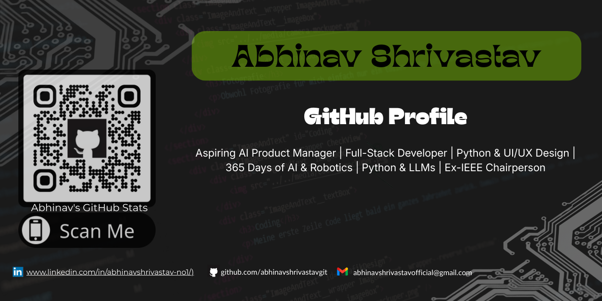

<h1 align="center">Hi 👋, I'm Abhinav Shrivastav</h1>
<h3 align="center">Aspiring AI Product Manager | Full-Stack Developer | Python & UI/UX Design | 365 Days of AI & Robotics | Python & LLMs | Ex-IEEE Chairperson
</h3>

  

---

## 👋 About Me

* 🚀 **Aspiring AI Product Manager** focused on bridging the gap between raw data and business value.
* 🏗️ **Building Sentinel-Leads:** A major project implementing iterative logic and transparent decision trees to prioritize high-value sales targets.
* 📊 **Methodology-Driven:** Applying the **IBM Data Science Methodology** to ensure technical projects solve real-world "Business Understanding" problems.
* 🛠️ **Tech Stack:** Python (Logic & LLMs), SQL (Data Requirements), and Product Management (PRDs & System Architecture).
* 📈 **Daily Growth Score:** Dedicated to 1% daily technical and strategic improvement over short bursts of effort.

> "I value code that makes decisions and data that drives revenue."

---

## 🛠️ Tech Stack & Lab Roadmap

### 🔹 Core Languages & Methodology
    
* **Real Growth:** Applying iterative logic and Decision Trees to recover lost e-commerce revenue.

### 🔹 Database & Infrastructure (Next Mastery)
   
* **Status:** 🚧 Currently mastering SQL to handle high-volume lead data for the AI Product Suite.

### 🔹 Web & Backend (Future Roadmap)
   
* **Status:** 🎯 Future goal to build APIs that serve Product Intelligence to live dashboards.

---

## 📊 GitHub at a Glance

  

  

  

<!-- 

   

 -->

  <i>Consistency matters more than intensity.</i>

---

### 🌟 Featured Projects
## 🔹[Sentinel-Leads](https://github.com/abhinavshrivastavgit/Abhinav-AI-Product-Suite/tree/main/Sentinel-Leads) (Major): ##
*   AI-driven revenue recovery and sales funnel optimization engine.
## 🔹[Portfolio Website](https://github.com/abhinavshrivastavgit/Portfolio) (Major): ##
*   Professional personal portfolio built with HTML, CSS, and JavaScript.
## 🔹[Python Logic Foundation](https://github.com/abhinavshrivastavgit/python_logic_foundation) (Minor): ##
*   Daily algorithmic drills and foundational problem-solving logic.
  
> ⭐ More projects coming as I continue building and learning.
---

### 🚧 What I’m Currently Working On
* 🧪 Refining the **Analytic Approach** for e-commerce lead classification.
* 🌳 Developing **Decision Tree** models for the Sentinel-Leads logic engine.
* 📚 Strengthening DSA and Problem-Solving skills daily.
---

## 🤝 Connect With Me

  
  
 

---

## ✍️ Random Dev Quote

  
  
Randomly Generated Quotes :point_up_2:

---

  <b>Thanks for visiting my profile! 😊</b> 
  <i>Feel free to explore my repositories and follow my journey.</i>

